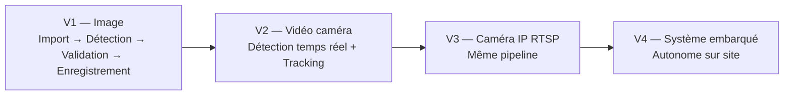
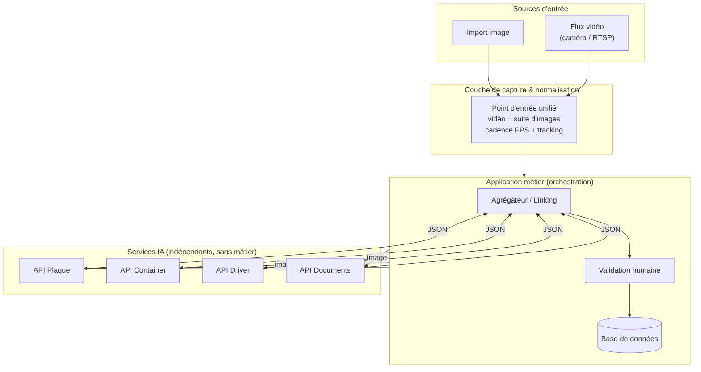
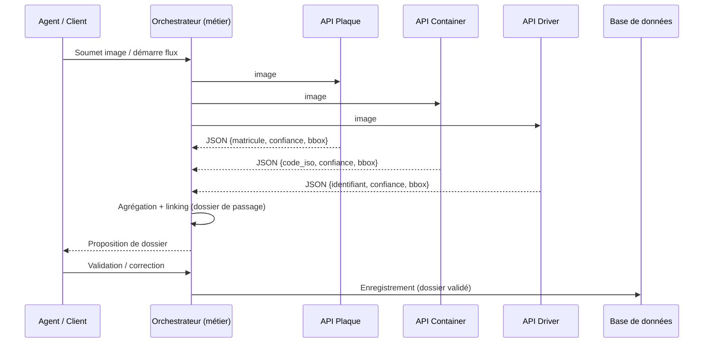
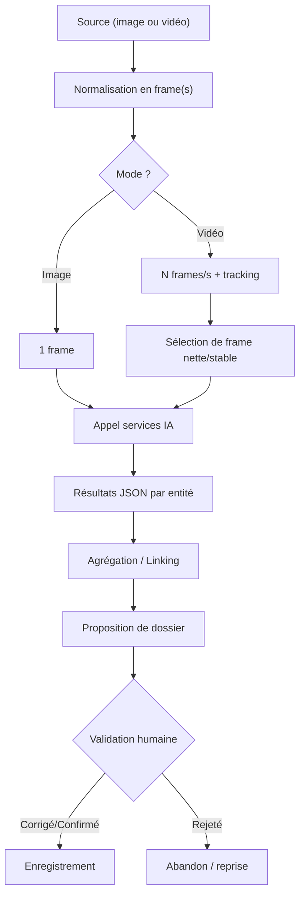
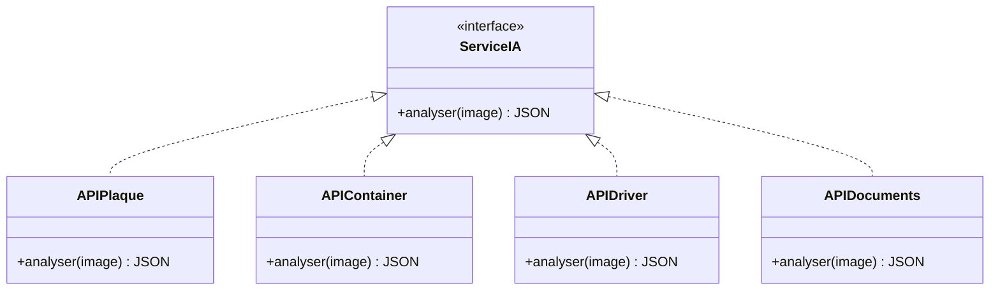
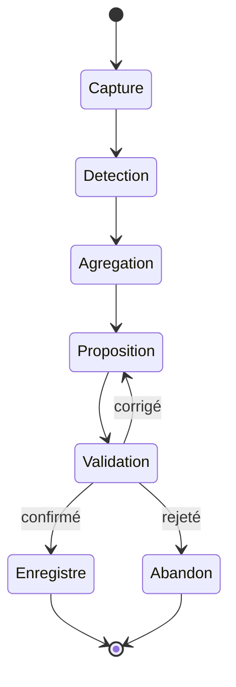
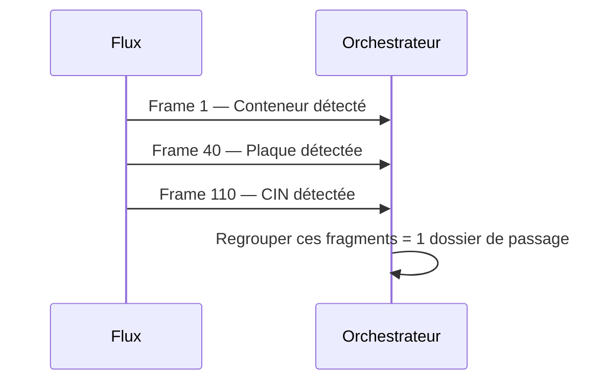
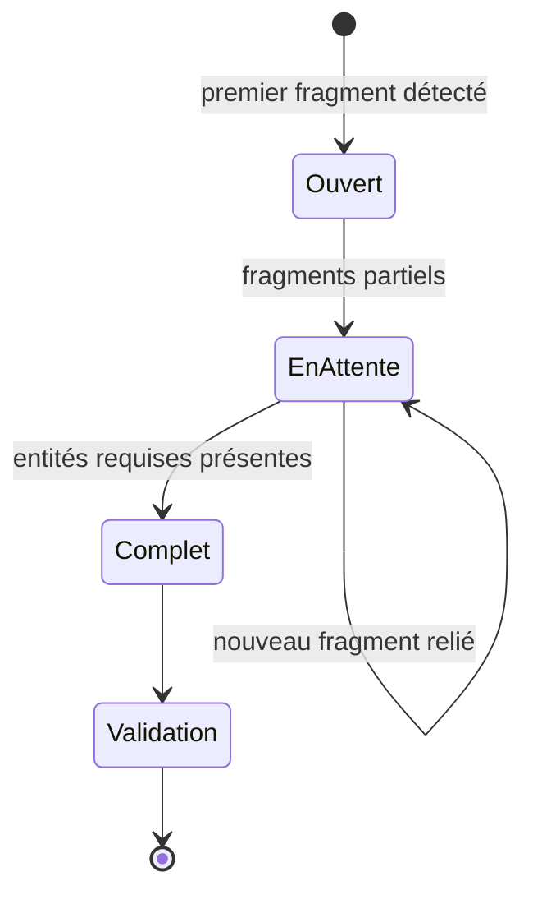
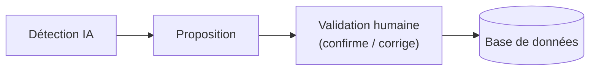
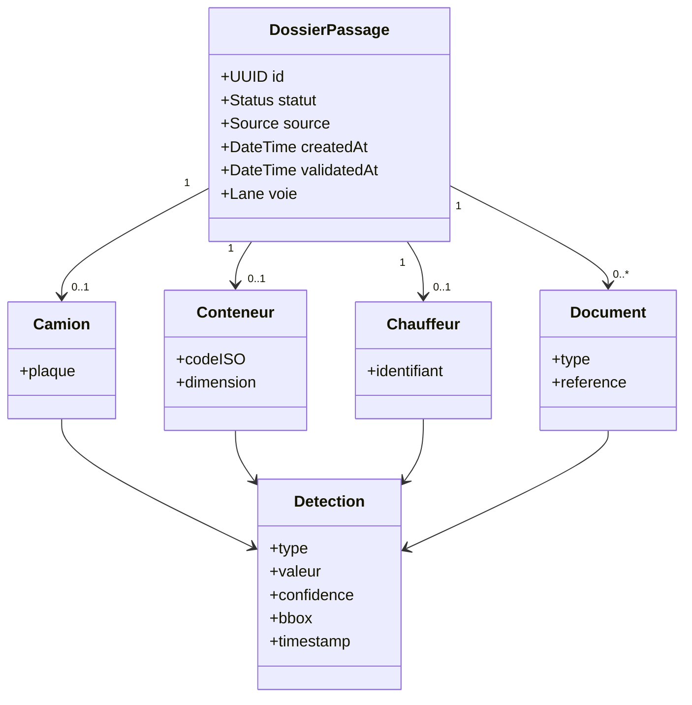

# SmartContainer_AI — Spécification d'Architecture (SPEC.md)

> **Statut** : Document de référence — *Single Source of Truth*
> **Destinataire** : Claude Code (agent de développement) et équipe projet
> **Nature** : Spécification d'architecture et de produit. Ce document définit **l'intention, les contraintes et les invariants** du système. Il **ne contient aucun code métier** et ne prescrit pas d'implémentation ligne à ligne.
> **Convention** : chaque affirmation est marquée `[EXIGENCE]` (confirmée, contraignante) ou `[HYPOTHÈSE]` (proposée par défaut, à valider — voir §14 Questions ouvertes). Toute `[HYPOTHÈSE]` peut être révisée ; toute `[EXIGENCE]` ne peut l'être qu'explicitement.

---

## 1. Vision

SmartContainer_AI est une **plateforme d'intelligence artificielle** destinée à **automatiser l'enregistrement des camions** entrant dans un terminal portuaire (Marsa Maroc, Port de Casablanca).

Aujourd'hui, le processus est essentiellement **manuel** : un agent contrôle le camion, le conteneur, le chauffeur et les documents, puis saisit les informations à la main. Cette saisie est lente et source d'erreurs, alors que le camion ne stationne que quelques secondes au point de contrôle.

Le système vise à **reconnaître automatiquement** les informations visibles et documentaires, à les **agréger en un dossier de passage unique**, à les **soumettre à validation humaine**, puis à les **enregistrer**. L'objectif produit est la **réduction du temps de traitement** au point de contrôle, sans jamais sacrifier la fiabilité du contrôle humain.

`[EXIGENCE]` Le système est un **assistant à la décision**, pas un système d'enregistrement autonome. La reconnaissance IA **propose** ; l'agent humain **dispose**.

---

## 2. Objectifs & principes directeurs

Le système est construit autour de six principes structurants. Ils gouvernent toutes les décisions d'architecture.

| # | Principe | Enoncé |
|---|----------|--------|
| P1 | **Temps réel** | La détection doit être rapide et la latence minimale : le camion ne reste que quelques secondes. |
| P2 | **Modularité** | Chaque modèle IA est un service totalement indépendant, sans logique métier, réutilisable ailleurs. |
| P3 | **Orchestration** | Une application centrale porte **toute** la logique métier et coordonne les services IA. |
| P4 | **Linking** | Des informations arrivant à des instants différents sont reliées automatiquement dans un même dossier. |
| P5 | **Validation** | Aucune donnée n'est enregistrée sans validation humaine préalable. |
| P6 | **Évolutivité** | On peut ajouter un nouveau modèle IA sans modifier les autres ni l'orchestrateur. |

### P1 — Contraintes temps réel

`[EXIGENCE]` Le système doit optimiser conjointement : la **cadence de traitement (FPS)**, le **tracking** d'objets entre frames, le **coût de l'OCR**, et le **temps de réponse global** de bout en bout.

`[EXIGENCE]` La latence est un objectif de **premier ordre** : elle prime sur des gains marginaux de précision lorsqu'un arbitrage est nécessaire.

`[HYPOTHÈSE]` Le levier principal de latence n'est pas le choix du modèle de détection mais la **stratégie de pipeline** : détecter et suivre un objet, puis ne déclencher l'OCR **qu'une seule fois**, sur une image stable et nette, plutôt que sur chaque frame.

### P2 — Modularité des services IA

`[EXIGENCE]` Chaque modèle IA est exposé comme un **service autonome** :
- **Entrée** : une image.
- **Sortie** : un JSON structuré.
- **Aucune logique métier** interne.

`[EXIGENCE]` Un service IA ignore **qui** l'appelle et **pourquoi**. Il doit pouvoir être réutilisé dans n'importe quelle autre application (extension, app mobile, système tiers).

### P3 — Orchestration centralisée

`[EXIGENCE]` **Toute** la logique métier réside dans la couche d'orchestration : réception de l'entrée, appel des services IA, agrégation, création du dossier de passage, gestion de la validation, persistance.

### P4 — Linking

`[EXIGENCE]` Le système doit relier des fragments détectés à des instants différents (conteneur en frame N, plaque en frame N+40, CIN en frame N+110) dans un **même dossier de passage**.

### P5 — Validation

`[EXIGENCE]` Chaîne obligatoire : **Détection → Proposition → Validation humaine → Base de données**. Aucune écriture automatique.

### P6 — Évolutivité

`[EXIGENCE]` L'ajout d'un nouveau service IA ne doit exiger **aucune** modification des services existants, et au plus une **déclaration** (enregistrement) au niveau de l'orchestrateur.

---

## 3. Périmètre & non-périmètre

**Dans le périmètre :**
- Reconnaissance IA d'entités depuis image et vidéo.
- Agrégation (linking) en dossier de passage.
- Interface de validation humaine.
- Persistance des dossiers validés et historique.

**Hors périmètre (à ce stade) :**
- `[HYPOTHÈSE]` Intégration directe au SI de Marsa Maroc (échange de données officiel).
- `[HYPOTHÈSE]` Reconnaissance de zones **manuscrites** par OCR automatique (voir §7 et §13).
- `[HYPOTHÈSE]` Prédiction du contenu des conteneurs (perspective ultérieure).

---

## 4. Roadmap

| Version | Entrée | Ajout par rapport à la précédente | Statut |
|---------|--------|-----------------------------------|--------|
| **V1** | Import d'image | Socle : pipeline détection + validation + persistance | Fondation |
| **V2** | Vidéo caméra téléphone | Découpage en frames, temps réel, **tracking** | Cible actuelle |
| **V3** | Caméra IP **RTSP** | Nouvelle source, **même pipeline aval** | Prévu |
| **V4** | Système embarqué | Autonomie matérielle sur site | Perspective |

`[EXIGENCE]` V1 n'est pas jetable : elle constitue le **socle** que V2/V3/V4 étendent. Le pipeline aval (détection → agrégation → validation → persistance) est **commun à toutes les versions**.

`[EXIGENCE]` Le support **RTSP (V3)** doit être conçu dès maintenant comme une **extension enfichable** de la couche de capture, et non comme une refonte.

---

## 5. Contraintes

### 5.1 Contraintes fonctionnelles
- `[EXIGENCE]` Validation humaine obligatoire avant tout enregistrement.
- `[EXIGENCE]` Support de deux modes d'entrée : import d'image et flux vidéo.
- `[EXIGENCE]` Capacité de linking différé entre entités.

### 5.2 Contraintes non-fonctionnelles
- `[EXIGENCE]` Latence minimale au point de contrôle (temps réel).
- `[EXIGENCE]` Réutilisabilité des services IA par des applications tierces.
- `[HYPOTHÈSE]` Objectif chiffré de latence/FPS à définir (voir §14).

### 5.3 Contraintes d'infrastructure
- `[EXIGENCE]` L'accès caméra navigateur requiert un **contexte sécurisé (HTTPS)** ; un tunnel sécurisé (ex. Cloudflare Tunnel) est architecturalement nécessaire pour V2 web.
- `[EXIGENCE]` Le déploiement se fait sur un **VPS partagé** : les changements doivent être **scopés** (ports, ressources) pour ne pas perturber les autres projets hébergés.

---

## 6. Architecture

### 6.1 Vue en couches

Le système sépare strictement deux mondes : les **services IA génériques** (sans métier) et l'**application métier** (orchestration). C'est l'invariant architectural fondamental.

### 6.2 Frontière fondamentale

| Couche | Responsabilité | Logique métier ? | Réutilisable ? |
|--------|----------------|------------------|----------------|
| **Services IA** | `image → JSON` | ❌ Jamais | ✅ Par toute application |
| **Capture** | source → flux d'images normalisé | ❌ | Partiellement |
| **Application métier** | linking, validation, persistance | ✅ Exclusivement ici | ❌ Spécifique Marsa |

`[EXIGENCE]` Aucune notion métier (dossier de passage, linking, validation, schéma de base) ne doit exister dans un service IA. Réciproquement, aucun service IA n'appelle un autre service IA : c'est l'orchestrateur qui coordonne.

### 6.3 Communication inter-composants

`[HYPOTHÈSE]` Les appels aux services IA sont indépendants et peuvent être **parallélisés** pour réduire la latence globale.

---

## 7. Pipeline de traitement

Le pipeline est **identique** quel que soit le mode d'entrée, car la vidéo est traitée comme une suite d'images.

`[EXIGENCE]` En mode vidéo, l'OCR n'est **pas** exécuté sur chaque frame. Le tracking identifie et suit un objet ; l'OCR est déclenché sur une image sélectionnée (stable, nette). Ce principe est le cœur de la maîtrise de latence.

`[HYPOTHÈSE]` Les zones **manuscrites** de certains documents (n° d'opération, CIN écrits à la main) ne sont pas fiables en OCR standard : elles relèvent d'une **saisie manuelle validée**, non d'une reconnaissance automatique, sauf décision contraire (§14).

---

## 8. Services IA

### 8.1 Contrat commun

`[EXIGENCE]` Tout service IA respecte le même contrat :

- **Entrée** : une image.
- **Sortie** : un JSON structuré comportant au minimum un **résultat**, un **score de confiance**, et une **zone de détection (bounding box)**.
- **Sans état, sans métier, sans effet de bord.**

`[EXIGENCE]` Le **contrat d'interface est stable** : le modèle sous-jacent peut être remplacé ou amélioré sans casser les clients, tant que l'entrée/sortie ne change pas.

### 8.2 Catalogue des services

| Service | Rôle | Sortie (indicative) |
|---------|------|---------------------|
| **API Plaque** | Détection + lecture de la plaque camion (dont **nouveau format marocain**) | matricule, confiance, bbox |
| **API Container** | Détection conteneur + lecture **code ISO/BIC** (4 lettres + 6 chiffres + 1 clé) | code, validité de la clé, confiance, bbox |
| **API Driver** | Lecture **CIN** ou **permis de conduire** | identifiant, confiance, bbox |
| **API Documents** | Extraction de champs documentaires (DUM, booking, transporteur…) | champs, confiance, bbox |

`[HYPOTHÈSE]` Modèle de détection recommandé : **YOLO11s** (variant *small*), meilleur compromis précision/latence pour du texte à lire en temps réel, écosystème mûr, migration triviale depuis YOLOv8. Le variant (`n`/`s`/`m`) et l'export d'inférence (ex. ONNX/TensorRT) sont des paramètres d'optimisation, non des exigences figées.

`[EXIGENCE]` L'ajout d'un futur service IA (ex. icônes IMDG, détection d'avaries) doit suivre le même contrat et **ne rien modifier** aux services existants.

---

## 9. Application métier (orchestration)

`[EXIGENCE]` L'orchestrateur est l'**unique** détenteur de la logique métier. Responsabilités :

1. Recevoir l'entrée (image ou vidéo) via la couche de capture.
2. Appeler les services IA nécessaires.
3. **Agréger** les résultats (linking) en un dossier de passage.
4. Présenter une **proposition** à l'agent.
5. Gérer la **validation/correction**.
6. **Enregistrer** le dossier validé.

---

## 10. Linking (agrégation différée)

### 10.1 Problème

Les entités d'un même camion sont détectées à des **instants différents** :

### 10.2 Cycle de vie du dossier de passage

`[EXIGENCE]` Le système doit gérer un état **« association en attente »** : un dossier peut exister avec des entités manquantes, à compléter ultérieurement (ex. conteneur détecté avant que la CIN ne soit scannée).

### 10.3 Stratégies de liaison

`[HYPOTHÈSE]` Deux stratégies, à combiner :
- **Par contexte** (fenêtre de temps + emplacement/voie) : propose une association automatique.
- **Par clé métier** (ex. **N° d'Opération** présent sur les documents Marsa) : confirme/verrouille l'association.

`[HYPOTHÈSE]` Le **N° d'Opération** est le candidat naturel de clé métier, car il agrège déjà conteneur + camion + chauffeur côté Marsa. À confirmer (§14).

---

## 11. Validation

`[EXIGENCE]` Chaîne stricte, sans court-circuit possible :

`[EXIGENCE]` L'agent voit les résultats **avec leur score de confiance** et peut **corriger** chaque champ avant enregistrement. Un score de confiance faible ne bloque pas la validation mais doit être **signalé** à l'agent.

---

## 12. Base de données

`[EXIGENCE]` Ne persiste que les **dossiers de passage validés** (plus, le cas échéant, les dossiers en attente non finalisés, distingués par leur statut).

`[HYPOTHÈSE]` Modèle de données autour de l'entité **Dossier de passage**, agrégeant des sous-entités :

`[HYPOTHÈSE]` L'entité **Detection** (valeur, `confidence`, `bbox`, `timestamp`) est **séparée** des entités métier (Camion, Conteneur, Chauffeur, Document). Cette séparation est intentionnelle : une entité métier porte l'information **validée** ; une `Detection` porte la **preuve brute** issue d'un service IA, horodatée, ce qui soutient le linking (§10) et la traçabilité de la validation (§11).

`[EXIGENCE]` **Les documents Marsa fournis servent uniquement à comprendre le métier.** Ils **ne définissent pas** les champs obligatoires du système. Les champs listés ci-dessus sont **indicatifs** ; le caractère obligatoire de chacun est une **question ouverte** (§14).

---

## 13. Invariants (règles absolues)

Ces règles ne peuvent **jamais** être violées. Toute proposition de code qui les enfreint doit être rejetée.

1. **I1 — Séparation stricte.** Un service IA ne contient **jamais** de logique métier ; entrée = image, sortie = JSON.
2. **I2 — Pipeline unique.** Vidéo et image partagent le **même pipeline aval** (via normalisation en images).
3. **I3 — Validation obligatoire.** **Aucun** enregistrement sans validation humaine.
4. **I4 — Contrats stables.** L'interface entrée/sortie des services IA est stable ; le modèle interne peut évoluer sans casser les clients.
5. **I5 — Indépendance des services.** Un service IA n'appelle jamais un autre service IA ; seul l'orchestrateur coordonne.
6. **I6 — Extensibilité.** On peut ajouter un nouveau modèle IA **sans modifier** les services existants ni casser l'orchestrateur.
7. **I7 — Métier centralisé.** Toute la logique métier vit dans la couche d'orchestration, nulle part ailleurs.
8. **I8 — Réutilisabilité.** Les services IA doivent rester utilisables par une application tierce qui ignore tout du métier Marsa.
9. **I9 — Scoping VPS.** Sur le VPS partagé, aucun changement ne doit perturber les autres projets hébergés.
10. **I10 — RTSP en extension.** Le support RTSP s'ajoute comme extension de la capture, jamais comme refonte du pipeline.

---

## 14. Questions ouvertes (à trancher avec le tuteur)

Ces décisions restent en suspens. Claude Code doit **signaler** et **ne pas trancher unilatéralement** un point de cette liste s'il bloque l'avancement.

| # | Question | Impact |
|---|----------|--------|
| Q1 | Quels champs sont **obligatoires** au-delà du code ISO ? (DUM, booking, P/V, transporteur…) | Modèle de données, validation |
| Q2 | Disponibilité d'un jeu d'**images/vidéos d'entraînement**, notamment nouveau format de plaque marocain ? | Faisabilité API Plaque |
| Q3 | Clé de linking officielle : le **N° d'Opération** fait-il autorité ? | Stratégie d'agrégation |
| Q4 | **Authentification** des agents nécessaire dès cette phase ? | Sécurité, périmètre V1/V2 |
| Q5 | Objectif de latence **chiffré** (FPS cible, délai max par détection) ? | Dimensionnement, choix de variant/export |
| Q6 | Les zones **manuscrites** doivent-elles être reconnues automatiquement (HTR) ou saisies manuellement ? | Périmètre API Documents |
| Q7 | Intégration future au **SI de Marsa** (échange de données) ? | Architecture d'intégration |

---

## 15. Risques

| Risque | Description | Atténuation |
|--------|-------------|-------------|
| **R1 — Latence OCR** | L'OCR standard est trop lent pour du temps réel frame-par-frame. | Tracking + OCR déclenché sur image nette uniquement ; réévaluer le moteur OCR. |
| **R2 — Données d'entraînement** | Absence de dataset pour le nouveau format de plaque marocain. | Collecte/annotation dédiée ; datasets publics (Roboflow) en complément. |
| **R3 — Fiabilité du linking** | Deux camions rapprochés peuvent être confondus par la stratégie contextuelle. | Confirmation par clé métier (N° Opération) en plus du contexte. |
| **R4 — Manuscrit** | Champs manuscrits illisibles en OCR. | Saisie manuelle validée pour ces zones. |
| **R5 — VPS partagé** | Interférence avec les projets des autres. | Scoping strict des ports/ressources (I9). |
| **R6 — Dérive de périmètre** | Ajouts successifs de besoins non cadrés. | Ce SPEC comme source de vérité ; toute évolution passe par mise à jour explicite. |

---

## 16. Évolutions futures

- `[HYPOTHÈSE]` Ajout de services IA supplémentaires (icônes IMDG, détection d'avaries conteneur).
- `[HYPOTHÈSE]` Application mobile dédiée (V4 / système embarqué).
- `[HYPOTHÈSE]` Prédiction du contenu des conteneurs à partir de données historiques.
- `[HYPOTHÈSE]` Intégration au SI de Marsa Maroc.

Chacune de ces évolutions doit respecter les invariants (§13) et, en particulier, la frontière entre services IA génériques et application métier.

---

## 17. Directives pour Claude Code

1. Traiter ce document comme la **source de vérité** de l'intention produit et d'architecture.
2. Respecter **sans exception** les invariants (§13) dans toute proposition.
3. Construire de manière **incrémentale** : consolider V1 (image + validation + persistance), puis ajouter la couche vidéo + tracking (V2), puis RTSP (V3).
4. Ne **jamais** mélanger la couche détection (générique) et la couche application (métier).
5. **Signaler** — sans trancher seul — tout point du code qui exigerait de résoudre une **question ouverte** (§14).
6. Distinguer en permanence `[EXIGENCE]` (contraignant) et `[HYPOTHÈSE]` (révisable) : ne pas figer une hypothèse en dur sans validation.
7. Commente les code générer, les codes doivent etre maintenable, précis et correct en évitant les anomalies.
